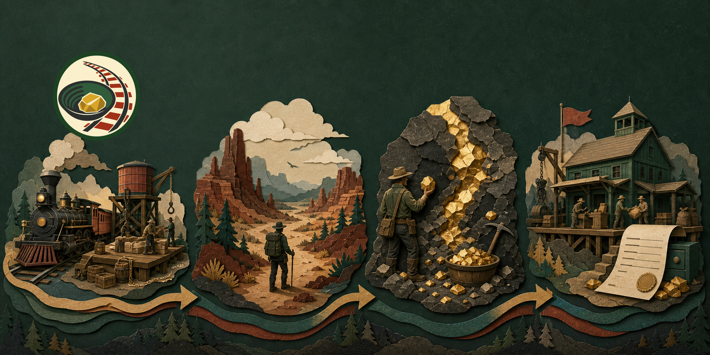

# Visual Identity

The repository identity represents the verified playable route: loading-yard
train, canyon traversal, gold mining, extraction, and scored receipts. It does
not imply final legacy-asset parity.

## Visual Language

- Deep forest green and charcoal represent the kit-owned runtime and public-safe
  operational boundary.
- Warm gold identifies mining, carried value, cashout, and score.
- Parchment and rust red reference route maps, receipts, rail infrastructure,
  and the western extraction setting.
- Layered paper-cut terrain communicates a composed procedural world without
  presenting generated artwork as an in-game screenshot.

## Asset Pack

Reusable files live in `docs/assets/brand/`:

- `logo-transparent.png`: gold pan, nugget, and rail-route mark.
- `logo-mask.svg`: editable single-color logo mask.
- `cover-1280x640.png`: complete playable-loop cover.
- `social-card.png`: cover with the repository mark.
- `manifest.json`: source hashes, processing settings, dimensions, and
  validation evidence.

Use meaningful alt text and preserve the full frame. Do not crop the train,
canyon route, mining site, extraction depot, or logo. Keep text outside the
artwork so the images remain reusable across GitHub and social surfaces.
